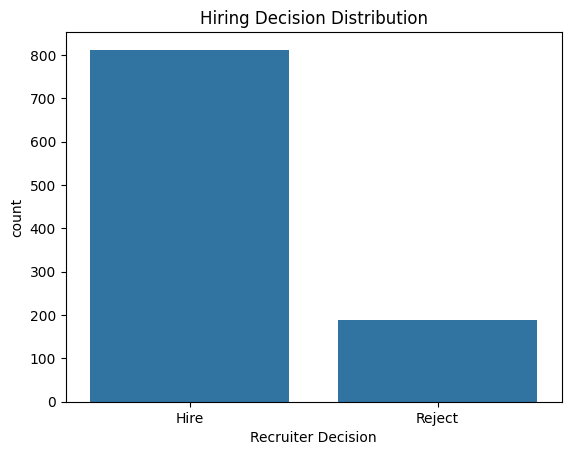
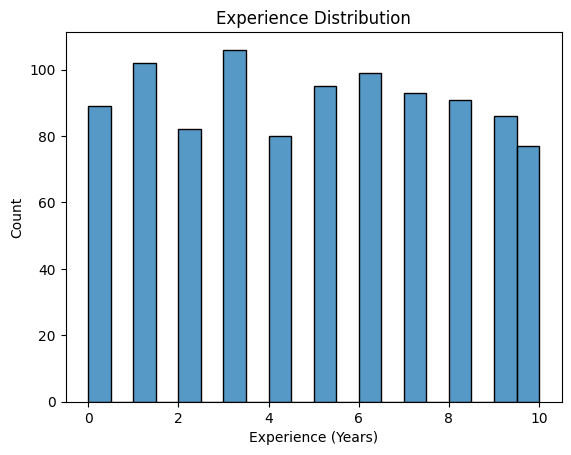
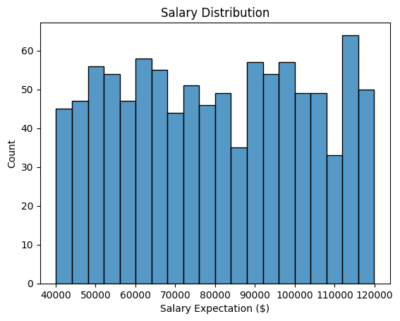
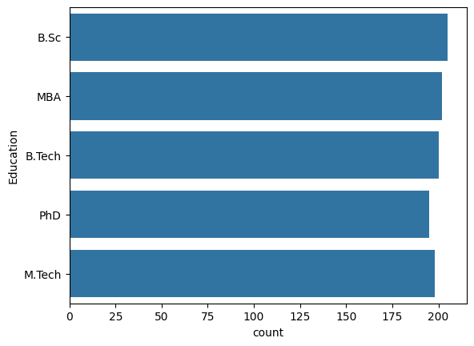
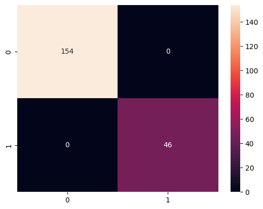
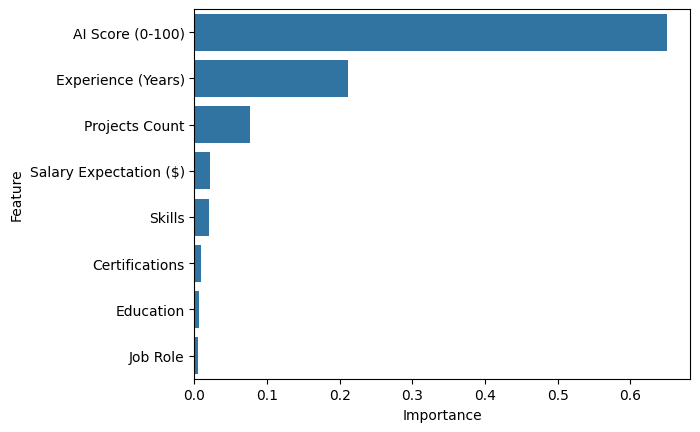

# 🤖 AI-Based Hiring Prediction System

An End-to-End Machine Learning Project that predicts whether a candidate is likely to be **Hired** or **Rejected** based on resume attributes such as skills, experience, education, certifications, projects, and salary expectations.

---

## 📌 Project Overview

Recruiters often receive hundreds of applications for a single job opening, making manual resume screening time-consuming and inefficient. This project demonstrates how Machine Learning can assist Human Resource (HR) teams by automating the initial candidate screening process.

The AI-Based Hiring Prediction System analyzes candidate information and predicts hiring outcomes using classification algorithms trained on historical recruitment data.

---

## 🎯 Project Objective

Develop a Machine Learning model capable of predicting hiring decisions based on candidate resume data.

### Target Variable

| Value | Decision |
| ----- | -------- |
| 1     | Hired    |
| 0     | Rejected |

---

## 📊 Dataset Features

The dataset contains synthetic resume data with the following attributes:

| Feature                | Description                      |
| ---------------------- | -------------------------------- |
| Resume_ID              | Unique Candidate Identifier      |
| Name                   | Candidate Name                   |
| Skills                 | Technical Skills                 |
| Experience (Years)     | Total Work Experience            |
| Education              | Highest Qualification            |
| Certifications         | Professional Certifications      |
| Job Role               | Applied Job Position             |
| Salary Expectation ($) | Expected Salary                  |
| Projects Count         | Number of Completed Projects     |
| Recruiter Decision     | Hiring Outcome (Target Variable) |

---

## 🛠️ Technologies Used

* Python
* Pandas
* NumPy
* Matplotlib
* Seaborn
* Scikit-Learn
* Joblib
* Jupyter Notebook

---

## 🔄 Machine Learning Workflow

```text
Data Collection
        ↓
Data Cleaning
        ↓
Exploratory Data Analysis (EDA)
        ↓
Feature Engineering
        ↓
Data Preprocessing
        ↓
Train-Test Split
        ↓
Model Training
        ↓
Model Evaluation
        ↓
Feature Importance Analysis
        ↓
Model Saving
        ↓
Hiring Prediction System
```

---

## 📈 Models Implemented

### 1️⃣ Logistic Regression

A baseline classification algorithm used for binary classification problems.

### 2️⃣ Decision Tree Classifier

A tree-based model that learns decision rules from data.

### 3️⃣ Random Forest Classifier

An ensemble learning algorithm that combines multiple decision trees for improved prediction performance.

---

## 📊 Exploratory Data Analysis

The project includes:

* Hiring Decision Distribution
* Experience Distribution Analysis
* Salary Expectation Analysis
* Education-Level Analysis
* Feature Importance Visualization
* Confusion Matrix Visualization

---

## 🧪 Model Evaluation Metrics

The models were evaluated using:

* Accuracy Score
* Confusion Matrix
* Classification Report
* Feature Importance Analysis

---

## 💾 Model Saving

The final trained model is saved using Joblib:

```python
import joblib

joblib.dump(model, "model.pkl")
```

The saved model can later be loaded without retraining:

```python
model = joblib.load("model.pkl")
```

---

## 🔮 Sample Prediction

```python
sample = X.iloc[[0]]

prediction = model.predict(sample)

print(prediction)
```

Output:

```text
[1] → Hired

or

[0] → Rejected
```

## 📷 Project Visualizations

### 1️⃣ Hiring Decision Distribution

This visualization shows the distribution of hiring outcomes in the dataset.



---

### 2️⃣ Experience Distribution

Displays the distribution of candidates based on years of experience.



---

### 3️⃣ Salary Expectation Distribution

Shows the spread of salary expectations among applicants.



---

### 4️⃣ Education Qualification Analysis

Visualizes the frequency of different educational qualifications.



---

### 5️⃣ Confusion Matrix

Evaluates the model's prediction performance by comparing actual and predicted values.



---

### 6️⃣ Feature Importance Analysis

Highlights the most influential features used by the Random Forest model for hiring predictions.



---

---

## 📁 Project Structure

```text
AI-Based-Hiring-Prediction-System/
│
├── data/
│   └── resumes.csv
│
├── images/
│   ├── hiring_distribution.png
│   ├── confusion_matrix.png
│   └── feature_importance.png
│
├── main/
│   └── AI_Hiring_Prediction.ipynb
│
├── model/
│   └── model.pkl
│
├── requirements.txt
├── README.md
└── .gitignore
```

---

## 🚀 Future Improvements

* Deploy the model using Streamlit
* Resume Parsing using NLP
* Skill Extraction from PDF Resumes
* Recruiter Dashboard
* Real-Time Hiring Recommendations
* Integration with Applicant Tracking Systems (ATS)

---

## 📚 Learning Outcomes

Through this project, I gained hands-on experience in:

* Data Cleaning and Preprocessing
* Exploratory Data Analysis (EDA)
* Feature Engineering
* Machine Learning Classification
* Model Evaluation
* Model Persistence using Joblib
* Building End-to-End ML Workflows

---

## 👨‍💻 Author

**Arpit Singh Tomar**


---

⭐ If you found this project interesting, consider giving the repository a star!